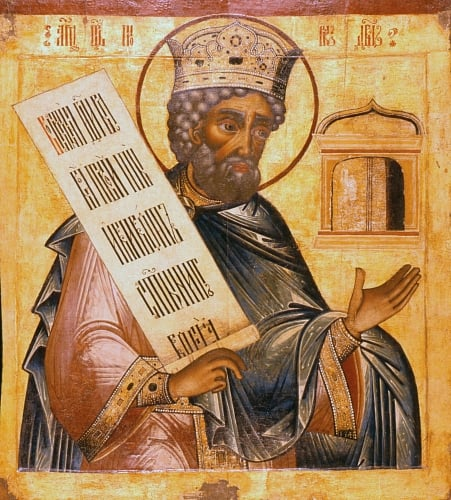

# Saint David’s Beacon

  

  Image source: <a href="https://www.flickr.com/photos/frted/page532">Flickr</a>

**Saint David’s Beacon** traces Psalms across texts, especially within the Orthodox Christian tradition. Named after the prophet St. David, the project uses technology to illuminate the Psalms’ spiritual significance and deepen understanding.
